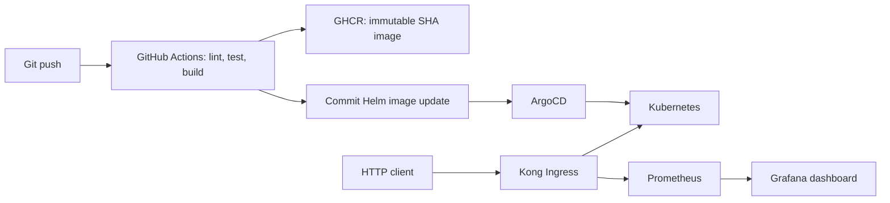

# Parallax Labs DevOps Internship

This repository contains the weekly infrastructure, application, CI/CD, GitOps, gateway, and monitoring deliverables for the Parallax Labs internship.

## Capstone

Start with the [Week 12 End-to-End Testing and Demo Day guide](weak12/README.md) for fresh-cluster setup, architecture, release verification, and demo evidence requirements.

## Weekly deliverables

| Week | Focus | Guide |
|---|---|---|
| 1-4 | Application, infrastructure, Kubernetes, and Helm | `weak 1/` through `weak 4/` |
| 5-7 | Istio, Kong, and CI | `weak 5/` through `weak 7/` |
| 8-9 | ArgoCD GitOps and Prometheus/Grafana | `weak 8/README.md`, `weak 9/README.md` |
| 10-11 | Alerting and metric-gated canary rollout | `week 10/README.md`, `week 11/README.md` |
| 12 | Integrated end-to-end release and demo | [weak12/README.md](weak12/README.md) |

The historical weekly folders retain their original `weak N` names to avoid breaking existing scripts and manifests. The capstone deliverable lives in the requested `weak12/` directory.
