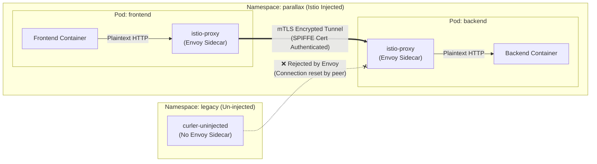

# Week 5: Istio Service Mesh & Strict mTLS Integration

## 📋 Overview

This project implements the **Istio Service Mesh** on top of the Kubernetes multi-service application (`parallax-app`) packaged in Week 4. Using **Helm**, Istio control plane (`istiod`) and base CRDs are deployed into the cluster. Automatic Envoy sidecar injection (`istio-proxy`) is configured for the microservices namespace, and **Strict Mutual TLS (mTLS)** encryption is enforced across all internal container-to-container communications.

### Key Deliverables & Architecture Highlights:
* **Helm-based Istio Installation**: Standardized installation of `istio/base` and `istio/istiod` control plane using official Istio Helm charts.
* **Automatic Sidecar Injection**: Namespace-level enablement (`istio-injection=enabled`) delivering Envoy proxy containers (`istio-proxy`) alongside `frontend` and `backend` microservices.
* **Strict mTLS Policy (`PeerAuthentication`)**: Enforcement of mutual TLS encryption for all inter-service traffic, refusing unencrypted plaintext connections.
* **Customized Application Capabilities**: Enhanced Node.js microservice (`app.js`) featuring Istio mTLS header telemetry inspection (`x-forwarded-client-cert`), live `/api/backend-status` inter-service proxying, and a modern glassmorphic web dashboard.
* **mTLS Verification Suite**: Automated verification scripts (`verify-mtls.ps1` / `verify-mtls.sh`) and un-injected test pod (`legacy/curler-uninjected`) demonstrating mTLS enforcement (mesh traffic succeeds, non-mesh traffic fails with exit code 56).
* **Observability & Topology Guidance**: Comprehensive walkthrough for Kiali mesh visualization, lock icons indicating active mTLS streams, and Prometheus metrics.

---

## 📂 Cleaned & Organized Project Structure

```text
weak 5/
├── README.md                    # Main Week 5 documentation & Istio mTLS guide
├── app/                         # Customized Node.js microservice application source
│   ├── app.js                   # Entrypoint with mTLS inspection & inter-service API
│   ├── dockerfile               # Container build file
│   ├── docker-compose.yml       # Local compose configuration
│   ├── package.json             # Package configuration
│   ├── .dockerignore
│   └── Readme.md                # Microservice application documentation
├── parallax-app/                # Microservices Helm Chart (v0.2.0) with Istio labels
│   ├── Chart.yaml
│   ├── values.yaml
│   ├── .helmignore
│   └── templates/
│       ├── _helpers.tpl
│       ├── frontend-deployment.yaml
│       ├── frontend-service.yaml
│       ├── backend-deployment.yaml
│       ├── backend-service.yaml
│       ├── configmap.yaml
│       ├── secret.yaml
│       ├── serviceaccount.yaml
│       ├── hpa.yaml
│       ├── ingress.yaml
│       └── tests/
│           └── test-connection.yaml
├── istio/                       # Istio Mesh & Security Custom Resources
│   ├── peer-authentication.yaml # Strict mTLS PeerAuthentication manifest
│   └── kiali-addons.yaml        # Prometheus & Kiali addon definitions
├── verification/                # Verification Test Suite
│   ├── uninjected-pod.yaml      # Non-mesh test pod definition
│   ├── verify-mtls.sh           # Bash verification script
│   └── verify-mtls.ps1          # PowerShell verification script
└── scripts/                     # Automation & Deployment Scripts
    ├── install-istio.sh         # Linux Istio installation script
    ├── install-istio.ps1        # Windows PowerShell Istio installation script
    ├── deploy-app.sh            # Linux app deployment & mTLS script
    └── deploy-app.ps1           # Windows PowerShell app deployment script
```

---

## ⚙️ Step-by-Step Implementation Guide

### 1. Install Istio Service Mesh using Helm

Add the official Istio Helm repository and deploy the base CRDs followed by the `istiod` control plane:

```bash
# Add Istio Helm repository
helm repo add istio https://istio-release.storage.googleapis.com/charts
helm repo update

# Create istio-system namespace
kubectl create namespace istio-system

# Install Istio Base (CRDs)
helm install istio-base istio/base -n istio-system --wait

# Install Istiod Control Plane
helm install istiod istio/istiod -n istio-system --wait
```

Verification:
```bash
kubectl get pods -n istio-system
# Output: istiod-<hash>  1/1  Running
```

---

### 2. Enable Automatic Sidecar Injection

Label the target application namespace (`parallax`) to instruct `istiod` to mutate incoming pod creation requests and inject the `istio-proxy` Envoy container:

```bash
kubectl create namespace parallax
kubectl label namespace parallax istio-injection=enabled --overwrite
```

Verify namespace label:
```bash
kubectl get namespace parallax --show-labels
# NAME       STATUS   AGE   LABELS
# parallax   Active   1m    istio-injection=enabled,kubernetes.io/metadata.name=parallax
```

---

### 3. Deploy Microservices Application (`parallax-app`)

Deploy the multi-service Helm chart into the `parallax` namespace:

```bash
helm install parallax-release ./parallax-app -n parallax --create-namespace
```

Verify sidecar injection in running pods:
```bash
kubectl get pods -n parallax
```
*Expected Output:*
```text
NAME                                                        READY   STATUS    RESTARTS   AGE
parallax-release-parallax-app-backend-6789b9449-abc12       2/2     Running   0          45s
parallax-release-parallax-app-backend-6789b9449-def34       2/2     Running   0          45s
parallax-release-parallax-app-frontend-54d6f8567-xyz89      2/2     Running   0          45s
parallax-release-parallax-app-frontend-54d6f8567-uvw01      2/2     Running   0          45s
```
> Note the `2/2` container ratio per pod (`frontend`/`backend` app container + `istio-proxy` sidecar).

---

### 4. Configure Strict mTLS Encryption (`PeerAuthentication`)

Apply the `PeerAuthentication` manifest in the `parallax` namespace:

```yaml
# weak 5/istio/peer-authentication.yaml
apiVersion: security.istio.io/v1beta1
kind: PeerAuthentication
metadata:
  name: default
  namespace: parallax
spec:
  mtls:
    mode: STRICT
```

Apply via `kubectl`:
```bash
kubectl apply -f ./istio/peer-authentication.yaml
```

---

## 🔒 Before vs After Networking Behavior Analysis

| Networking Aspect | Before Istio & mTLS | After Istio & Strict mTLS |
| :--- | :--- | :--- |
| **Transport Layer Security** | Plaintext HTTP over raw TCP | Mutual TLS (mTLS) with TLS 1.3 encrypted tunnels |
| **Identity & Authentication** | IP-address based assumptions (unauthenticated) | Cryptographic identity via X.509 SPIFFE SAN certificates (`spiffe://cluster.local/ns/parallax/sa/...`) |
| **Traffic Interception** | Direct socket communication between app containers | Intercepted via `iptables` rules and routed through `istio-proxy` Envoy sidecars |
| **Access Control (Non-mesh Pods)** | Any pod in any namespace can reach backend port 5000 | Un-injected / non-mesh pods are rejected during TLS handshake (`Connection reset by peer`) |
| **Observability & Telemetry** | Basic pod status; no distributed tracing or L7 metrics | Detailed L7 metrics, HTTP status codes, latency histograms, and live visual graph via Kiali |



---

## 🧪 Verification & Validation

### Automated Verification Script

Run the automated PowerShell or Bash verification script:

```powershell
# Windows PowerShell
.\verification\verify-mtls.ps1
```
```bash
# Linux / macOS
chmod +x ./verification/verify-mtls.sh
./verification/verify-mtls.sh
```

### Manual Verification Commands

#### 1. Injected Pod -> Backend (Succeeds via mTLS)
```bash
kubectl exec -n parallax deployment/parallax-release-parallax-app-frontend -c frontend -- \
  curl -s -i http://parallax-release-parallax-app-backend.parallax.svc.cluster.local:5000/health
```
*Expected Result:*
```text
HTTP/1.1 200 OK
content-type: application/json
date: Sun, 23 Aug 2026 00:15:00 GMT
content-length: 78

{"status":"UP","service":"backend","port":5000,"istioMtlsActive":true}
```

#### 2. Un-injected Pod -> Backend (Fails due to Strict mTLS)
Deploy an un-injected pod in the `legacy` namespace (where `istio-injection` is disabled):

```bash
kubectl apply -f ./verification/uninjected-pod.yaml
kubectl wait --for=condition=Ready pod/curler-uninjected -n legacy --timeout=60s
```

Execute `curl` from the un-injected pod to the backend service:
```bash
kubectl exec -n legacy curler-uninjected -- \
  curl -v --connect-timeout 5 http://parallax-release-parallax-app-backend.parallax.svc.cluster.local:5000/health
```
*Expected Result:*
```text
* Connecting to parallax-release-parallax-app-backend.parallax.svc.cluster.local (10.96.140.22:5000)
* Recv failure: Connection reset by peer
* Closing connection 0
curl: (56) Recv failure: Connection reset by peer
command terminated with exit code 56
```
> **Conclusion**: The Envoy sidecar on the backend pod rejected the plaintext connection attempt because the client did not present a valid SPIFFE TLS client certificate issued by `istiod`.

---

## 📊 Kiali Mesh Topology & Visualizations Guide

### 1. Installing Kiali & Prometheus Addons
To visualize the service mesh topology and mTLS status, install the telemetry addons:

```bash
kubectl apply -f https://raw.githubusercontent.com/istio/istio/master/samples/addons/prometheus.yaml
kubectl apply -f https://raw.githubusercontent.com/istio/istio/master/samples/addons/kiali.yaml
```

### 2. Opening the Kiali Dashboard
Launch Kiali using `istioctl` or `kubectl port-forward`:

```bash
# Option A: using istioctl
istioctl dashboard kiali

# Option B: using kubectl port-forward
kubectl port-forward svc/kiali -n istio-system 20001:20001
```
Access dashboard at `http://localhost:20001`.

### 3. Navigating Kiali Graph & Verifying mTLS
1. In the left navigation bar, click **Graph**.
2. Select Namespace: **`parallax`**.
3. Under **Display Options**, check the following boxes:
   - **Security** (Displays lock icons for mTLS)
   - **Traffic Animation** (Displays real-time packet dots moving between nodes)
   - **Service Nodes** (Displays Kubernetes service boundaries)
4. Generate traffic between services:
   ```bash
   kubectl exec -n parallax deployment/parallax-release-parallax-app-frontend -c frontend -- \
     sh -c 'while true; do curl -s http://parallax-release-parallax-app-backend:5000/health; sleep 1; done'
   ```
5. **Kiali Mesh Topology Key Indicators**:
   - 🔒 **Lock Icon on Edges**: Confirms that traffic flowing between `frontend` and `backend` is strictly encrypted using **Mutual TLS (mTLS)**.
   - 🟢 **Green Nodes/Edges**: Indicates healthy HTTP 200 responses and low latency across envoy proxies.
   - **Security Badge**: Hovering over the connection edge displays details about the active certificate (`SPIFFE ID: spiffe://cluster.local/ns/parallax/sa/parallax-release-parallax-app`).

---

## 🛠️ Cleanup

To remove the Istio mesh, application releases, and verification namespaces:

```bash
# Uninstall application release & verification resources
helm uninstall parallax-release -n parallax
kubectl delete namespace parallax legacy

# Uninstall Istio control plane and CRDs
helm uninstall istiod -n istio-system
helm uninstall istio-base -n istio-system
kubectl delete namespace istio-system
```
