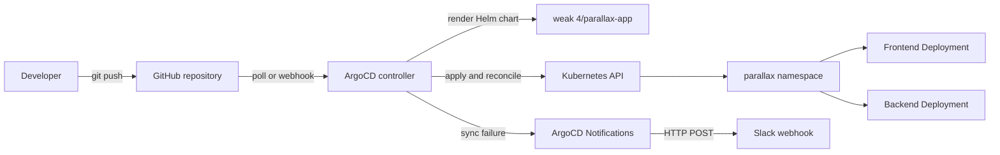

# Week 8 - GitOps with ArgoCD

This week connects the Parallax Helm chart from Week 4 to ArgoCD. ArgoCD watches the Git repository, renders the chart, and continuously reconciles the Kubernetes cluster with the desired state stored in Git.

## Objectives

- Install ArgoCD in the target Kubernetes cluster.
- Register the Git repository containing the Parallax Helm chart.
- Enable automated sync, pruning, and self-healing.
- Verify a Git change by scaling the frontend from two to three replicas.
- Send a Slack webhook notification when an application sync fails.
- Document the GitOps workflow and measure sync time.

## Repository layout

```text
weak 8/
├── README.md
├── argocd/
│   ├── application.yaml
│   ├── notification-configmap.yaml
│   └── notification-secret.example.yaml
├── scripts/
│   ├── install-argocd.ps1
│   ├── install-argocd.sh
│   ├── validate.ps1
│   └── validate.sh
└── verification/
    └── replica-sync-test.md
```

The ArgoCD `Application` points to `weak 4/parallax-app`, the Helm chart created in the earlier week. Replace `REPLACE_WITH_OWNER/REPOSITORY` in [argocd/application.yaml](argocd/application.yaml) with the HTTPS URL of the GitHub repository before applying it.

## Architecture



The desired state is Git. ArgoCD is the reconciler, Kubernetes is the execution plane, and the application pods are the runtime. A manual `kubectl scale` is temporary: self-healing restores the replica count declared by Git.

## Install

From the repository root, run the installer for the current shell:

```powershell
.\weak 8\scripts\install-argocd.ps1
```

```bash
bash "weak 8/scripts/install-argocd.sh"
```

The initial admin password is available with `argocd admin initial-password -n argocd`. For local UI access, run `kubectl -n argocd port-forward svc/argocd-server 8080:443`.

## Configure the Application

Edit [argocd/application.yaml](argocd/application.yaml), set `spec.source.repoURL` to the GitHub repository URL, and confirm that `targetRevision` and `spec.source.path` match the branch and chart location in Git.

```bash
kubectl apply -f "weak 8/argocd/application.yaml"
kubectl -n argocd get application parallax-app
argocd app get parallax-app
```

The first sync creates the `parallax` namespace and deploys the frontend and backend from the Week 4 chart. Automated sync, pruning, and self-healing are enabled in the Application resource.

## Failure notifications

ArgoCD Notifications is installed with current ArgoCD releases. Replace the placeholder webhook value in [argocd/notification-secret.example.yaml](argocd/notification-secret.example.yaml), then apply:

```bash
kubectl apply -f "weak 8/argocd/notification-secret.example.yaml"
kubectl apply -f "weak 8/argocd/notification-configmap.yaml"
kubectl -n argocd rollout restart deployment argocd-notifications-controller
```

The `on-sync-failed` trigger sends the application name, revision, and sync status to Slack. The example secret is not a real credential; never commit a real webhook URL. Use a secret manager or sealed secret in production.

## GitOps sync test

The reproducible test is documented in [verification/replica-sync-test.md](verification/replica-sync-test.md). In brief:

```bash
git checkout -b test/argocd-replica-sync
# edit weak 4/parallax-app/values.yaml: frontend.replicaCount 2 -> 3
git add "weak 4/parallax-app/values.yaml"
git commit -m "test: scale frontend through GitOps"
git push origin test/argocd-replica-sync
```

After merging or changing `targetRevision` to that branch, measure the interval between the GitHub push timestamp and the first three-pod observation:

```bash
kubectl -n parallax get pods -l app.kubernetes.io/component=frontend -w
argocd app wait parallax-app --sync --health --timeout 180
argocd app get parallax-app
```

Record the timestamps and observed duration in the verification document. The expected end state is `Synced`, `Healthy`, and three frontend replicas.

## Validation

From the repository root, run `\.\weak 8\scripts\validate.ps1` in PowerShell or `bash "weak 8/scripts/validate.sh"` in Bash. The checks render the chart and validate the ArgoCD resources client-side.

## Troubleshooting

- `Unknown` application health: inspect `argocd app events parallax-app` and confirm the repository URL is reachable.
- `ComparisonError`: verify the chart path and that the Git branch contains `weak 4/parallax-app`.
- No Slack message: confirm the secret key is `slack-webhook-url`, then inspect `kubectl -n argocd logs deploy/argocd-notifications-controller`.
- Sync is not automatic: check that `automated`, `prune`, and `selfHeal` are enabled in the Application resource.