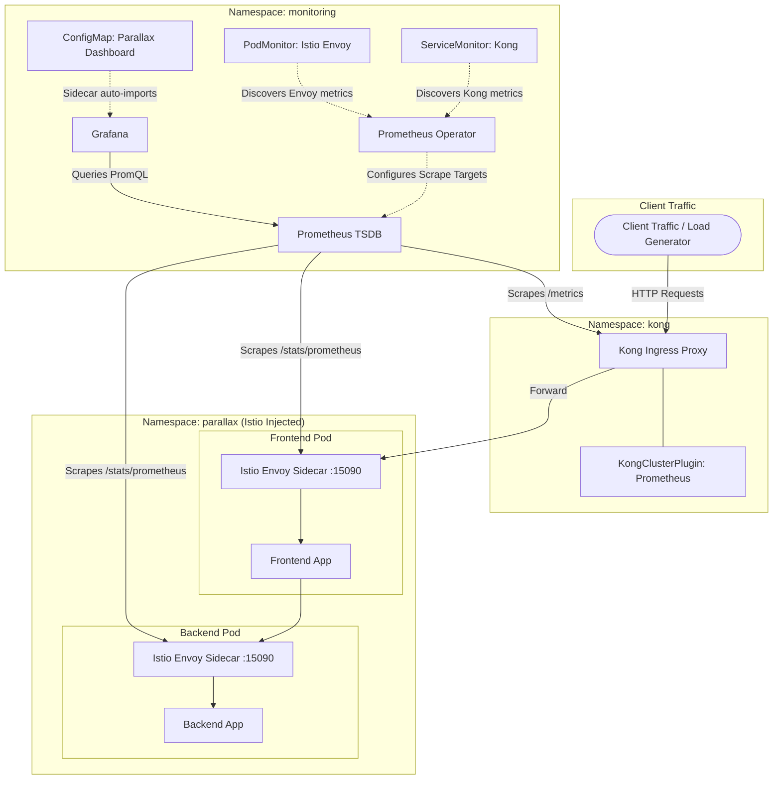

# Week 9: Observability with Prometheus and Grafana

This module integrates an enterprise-grade, code-managed observability and monitoring stack into the Parallax microservices architecture. Using the `kube-prometheus-stack` Helm chart, Prometheus Operator dynamically scrapes telemetry from Istio Envoy sidecars and Kong API Gateway, while Grafana automatically imports provisioned dashboards from Kubernetes ConfigMaps.

---

## 🏗️ Architecture & Telemetry Flow



---

## 📁 Repository Layout

```text
weak 9/
├── monitoring/
│   ├── app-podmonitor.yaml          # Scrapes Istio Envoy proxies on port http-envoy-prom (15090)
│   ├── grafana-dashboard.yaml       # ConfigMap containing 'Parallax Services and Kong' dashboard JSON
│   ├── kong-prometheus-plugin.yaml  # Global KongClusterPlugin enabling /metrics on Kong
│   ├── kong-servicemonitor.yaml     # Scrapes Kong metrics from the kong-admin/metrics service
│   └── values.yaml                  # Helm values for kube-prometheus-stack (retention, sidecar dashboard discovery)
├── scripts/
│   ├── install-monitoring.ps1       # Automated installation script (PowerShell)
│   ├── install-monitoring.sh        # Automated installation script (Bash)
│   ├── generate-load.ps1            # Traffic generator for testing & dashboard metrics (PowerShell)
│   ├── generate-load.sh             # Traffic generator for testing & dashboard metrics (Bash)
│   ├── validate.ps1                 # Manifest & Helm template validator (PowerShell)
│   └── validate.sh                  # Manifest & Helm template validator (Bash)
└── README.md
```

---

## 📋 Prerequisites

- **Kubernetes Cluster** (v1.24+) with Parallax services running in namespace `parallax`.
- **Istio Service Mesh** installed with sidecar injection active on namespace `parallax` (`istioctl` / `istio-injection=enabled`).
- **Kong Ingress Controller** installed in namespace `kong`.
- **Helm 3** and **kubectl** installed and configured for cluster communication.

---

## 🚀 Installation & Setup

### Automated Installation

Run the installation script matching your terminal environment from the repository root:

**PowerShell (Windows):**
```powershell
powershell.exe -ExecutionPolicy Bypass -File ".\weak 9\scripts\install-monitoring.ps1"
```

**Bash (Linux / macOS):**
```bash
bash "weak 9/scripts/install-monitoring.sh"
```

### What the installer executes:

1. Adds and updates the `prometheus-community` Helm repository.
2. Deploys or upgrades `kube-prometheus-stack` into the `monitoring` namespace using [`monitoring/values.yaml`](monitoring/values.yaml).
3. Applies [`monitoring/app-podmonitor.yaml`](monitoring/app-podmonitor.yaml) to scrape Istio Envoy sidecars.
4. Applies [`monitoring/kong-prometheus-plugin.yaml`](monitoring/kong-prometheus-plugin.yaml) and [`monitoring/kong-servicemonitor.yaml`](monitoring/kong-servicemonitor.yaml) to enable and scrape Kong metrics.
5. Deploys [`monitoring/grafana-dashboard.yaml`](monitoring/grafana-dashboard.yaml) with the `grafana_dashboard: "1"` label for automatic discovery.
6. Waits for Grafana and Prometheus pods to achieve ready status.

---

## 📊 Accessing Grafana & Prometheus

### 1. Port-Forward Services

To access Grafana and Prometheus locally:

```powershell
# Port-forward Grafana (port 3000)
kubectl port-forward -n monitoring svc/kube-prometheus-stack-grafana 3000:80

# (Optional) Port-forward Prometheus UI (port 9090)
kubectl port-forward -n monitoring svc/kube-prometheus-stack-prometheus 9090:9090
```

### 2. Retrieve Grafana Admin Password

Default username is `admin`. Retrieve the auto-generated password with:

**PowerShell:**
```powershell
kubectl get secret kube-prometheus-stack-grafana -n monitoring -o jsonpath="{.data.admin-password}" | %{ [Text.Encoding]::UTF8.GetString([Convert]::FromBase64String($_)) }
```

**Bash:**
```bash
kubectl get secret kube-prometheus-stack-grafana -n monitoring -o jsonpath="{.data.admin-password}" | base64 --decode; echo
```

### 3. Open Dashboard

1. Navigate to [http://localhost:3000](http://localhost:3000).
2. Log in with `admin` and your decoded password.
3. Open **Dashboards** > **Parallax Services and Kong**.

---

## 📈 PromQL Metrics Reference

The provisioned dashboard tracks key Golden Signals across both the Istio service mesh and the Kong API Gateway:

| Metric Panel | PromQL Query | Description |
| :--- | :--- | :--- |
| **Service Request Rate** | `sum(rate(istio_requests_total{destination_service_namespace="parallax"}[5m])) by (destination_service_name)` | Total inbound HTTP requests per second across `frontend` and `backend`. |
| **HTTP Error Rate (%)** | `100 * sum(rate(istio_requests_total{destination_service_namespace="parallax",response_code=~"[45].."}[5m])) by (destination_service_name) / sum(rate(istio_requests_total{destination_service_namespace="parallax"}[5m])) by (destination_service_name)` | Percentage of HTTP requests resulting in `4xx` or `5xx` responses. |
| **p95 Request Latency** | `histogram_quantile(0.95, sum(rate(istio_request_duration_milliseconds_bucket{destination_service_namespace="parallax"}[5m])) by (le, destination_service_name))` | 95th percentile response time in milliseconds for mesh services. |
| **Kong Gateway Request Rate** | `sum(rate(kong_http_requests_total[5m])) by (service)` | Inbound traffic throughput processed by the Kong Ingress Gateway. |

---

## ⚡ Generating Synthetic Traffic & Verifying Metrics

To generate traffic containing both standard requests (`200 OK`) and intentional error requests (`404 Not Found`) to test Grafana panels:

### 1. Port-Forward Kong Ingress Proxy
```powershell
kubectl port-forward -n kong svc/kong-kong-proxy 8080:80
```

### 2. Run the Load Generator

**PowerShell:**
```powershell
powershell.exe -ExecutionPolicy Bypass -File ".\weak 9\scripts\generate-load.ps1" -BaseUrl "http://localhost:8080" -Requests 300 -ErrorEvery 10
```

**Bash:**
```bash
bash "weak 9/scripts/generate-load.sh" "http://localhost:8080" 300 10
```

### 3. Expected Observations
- **Service Request Rate**: Peaks in `frontend` and `backend` curves.
- **HTTP Error Rate**: Stays around ~10% reflecting the 1-in-10 synthetic error path.
- **Kong Gateway Request Rate**: Displays matching ingress throughput.

---

## 🧪 Local Manifest Validation

To validate syntax and ensure all Helm templates and Kubernetes manifests are compliant without needing a live cluster connection:

**PowerShell:**
```powershell
powershell.exe -NoProfile -ExecutionPolicy Bypass -File ".\weak 9\scripts\validate.ps1"
```

**Bash:**
```bash
bash "weak 9/scripts/validate.sh"
```

---

## 🔍 Troubleshooting & Diagnostic Commands

- **Check Pod Health in Monitoring Namespace:**
  ```powershell
  kubectl get pods -n monitoring
  ```

- **Verify Scrape Targets / Custom Resources:**
  ```powershell
  kubectl get podmonitor,servicemonitor -n monitoring
  ```

- **Inspect Prometheus Target Endpoints:**
  Port-forward Prometheus (`kubectl port-forward -n monitoring svc/kube-prometheus-stack-prometheus 9090:9090`) and check [http://localhost:9090/targets](http://localhost:9090/targets) to verify that `parallax-istio-proxies` and `kong-prometheus` targets are `UP (1/1)`.

- **Kong Admin Service Port Check:**
  If Kong metric scraping fails, verify Kong's admin port name with `kubectl get svc -n kong` and match the `port` name in [`monitoring/kong-servicemonitor.yaml`](monitoring/kong-servicemonitor.yaml).