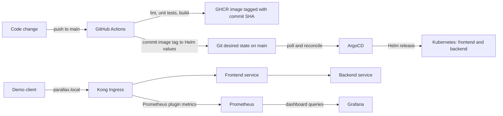

# Week 12: End-to-End Testing and Demo Day

This capstone connects the existing CI, GitOps, gateway, and monitoring work into one release path:



## Repository components

| Component | Location | Role |
|---|---|---|
| Application image and tests | `weak 7/app/` | Node.js services, CI lint, and unit tests |
| CI and GitOps image update | `.github/workflows/ci.yml` | Builds/pushes a SHA-tagged image, then updates the chart values |
| ArgoCD Application | `weak 8/argocd/application.yaml` | Reconciles the Kong-enabled chart from `main` |
| Kubernetes chart and Kong Ingress | `weak 6/parallax-app/` | Deploys frontend/backend, Kong plugins/consumer, and routes `parallax.local` through Kong |
| Kong installation | `weak 6/scripts/install-kong.ps1` | Installs the gateway/controller |
| Prometheus and Grafana | `weak 9/monitoring/` | Scrapes app and Kong metrics and provisions the dashboard |
| End-to-end verification | `weak12/scripts/verify-demo.ps1` | Checks ArgoCD, image rollout, Kong, Prometheus, and Grafana |
| Canary exercise | `week 11/` | Optional Istio/Argo Rollouts metric-gated deployment lab |

The baseline installers pin ArgoCD `v3.5.4`, Kong Ingress chart `0.24.0`, and kube-prometheus-stack chart `92.2.0` to avoid floating dependency upgrades.

## Requirements

- Docker Desktop, Minikube, and `kubectl` for the documented local cluster; Helm 3, Git, `curl.exe`, and PowerShell 5.1 or later.
- A reachable Kubernetes cluster and `kubectl` configured for its context if not using Minikube.
- A GitHub repository with Actions enabled and the default `GITHUB_TOKEN` allowed to write contents and packages.
- The `main` branch must allow the workflow to push its GitOps values update; if branch protection blocks direct pushes, configure a narrowly scoped exception or adapt the workflow to open a GitOps pull request.
- Make the `parallax-microservice` GHCR package **public** after its first successful publication, or configure a cluster `imagePullSecret` and the chart's `imagePullSecrets` value. Never commit a registry token.
- For local access, use a Kong proxy address reachable from your machine and map `parallax.local` to that address if you want to browse by hostname.

## Fresh-cluster setup

Start a local cluster with Docker Desktop running. Allocate at least 4 CPUs, 8 GiB of memory, and 40 GiB of disk:

```powershell
minikube start --driver=docker --kubernetes-version=v1.35.0 --cpus=4 --memory=8192 --disk-size=40g
kubectl config use-context minikube
kubectl wait --for=condition=Ready nodes --all --timeout=180s
```

Run the following commands from the repository root in order. The commands install the app through ArgoCD; do not also install a separate Helm release for the same app.

1. Install Kong and wait for its controller/proxy:

   ```powershell
   & ".\weak 6\scripts\install-kong.ps1"
   kubectl get pods -n kong
   kubectl get service -n kong
   ```

2. Install ArgoCD:

   ```powershell
   & ".\weak 8\scripts\install-argocd.ps1"
   ```

   The tracked Application is configured to this repository's HTTPS URL, `main`, and `weak 6/parallax-app`. For a fork, change `spec.source.repoURL` in [argocd/application.yaml](../weak%208/argocd/application.yaml) to the fork's clone URL before applying it.

3. Install Prometheus and Grafana, including Kong scraping and the dashboard:

   ```powershell
   & ".\weak 9\scripts\install-monitoring.ps1"
   ```

4. Apply the ArgoCD Application:

   ```powershell
   kubectl apply -f ".\weak 8\argocd\application.yaml"
   kubectl -n argocd get application parallax-app -w
   ```

   Wait for `Synced` and `Healthy`. The chart deploys both services and creates the Kong Ingress for `parallax.local`.

5. Push a tested application change to `main`:

   ```powershell
   git add "weak 7/app"
   git commit -m "feat: update Parallax service"
   git push origin main
   ```

   In GitHub Actions, verify that lint and tests pass before `Build and Push Docker Image` completes. The workflow pushes `ghcr.io/salehkhattak/parallax-microservice:<full-commit-sha>`, updates both image references in `weak 6/parallax-app/values.yaml`, and pushes that desired-state change to `main`. ArgoCD detects the chart update and deploys the same immutable tag. The workflow does not deploy directly with `kubectl`.

   On a fork, replace the example GHCR namespace in the text above with the repository owner's lower-case GHCR namespace. CI calculates the actual image name from the owner automatically.

6. Set up port forwards in separate PowerShell windows when the cluster does not expose LoadBalancer services:

   ```powershell
   kubectl port-forward -n kong service/kong-kong-proxy 8000:80
   ```

   ```powershell
   kubectl port-forward -n monitoring service/kube-prometheus-stack-prometheus 9090:9090
   ```

   ```powershell
   kubectl port-forward -n monitoring service/kube-prometheus-stack-grafana 3000:80
   ```

   The sample URLs below assume these forwards are active. The verification script sends `Host: parallax.local` to Kong, so it does not require a local hosts-file change. Add `127.0.0.1 parallax.local` to your hosts file only if you also want to browse the frontend by hostname. Obtain the Grafana admin password from the release's Kubernetes Secret rather than storing it in the repository.

7. Run the end-to-end checks with the SHA of the tested push:

   ```powershell
   & ".\weak12\scripts\verify-demo.ps1" `
     -ImageTag "<full-commit-sha>" `
     -KongUrl "http://localhost:8000/" `
     -PrometheusUrl "http://localhost:9090" `
     -GrafanaUrl "http://localhost:3000"
   ```

   The script verifies the ArgoCD sync/health state, deployed image tags and replica readiness, Kong ingress plus an HTTP request, Prometheus query results for `kong_http_requests_total`, and Grafana health/dashboard provisioning. It fails with an actionable error if any check fails.
   The backend check uses the existing `secret123` demo API key from the Week 6 consumer manifest; replace this test credential before exposing a non-demo environment.

## Demo-day acceptance checklist

- [ ] The source push is present in GitHub Actions and lint/unit tests are green.
- [ ] The image is available in GHCR with the source commit SHA tag.
- [ ] The workflow's GitOps update changed frontend and backend image tags; ArgoCD is `Synced` and `Healthy`.
- [ ] Both Kubernetes Deployments have their expected replicas available and run the tested SHA image.
- [ ] A request through Kong to `parallax.local` succeeds.
- [ ] Prometheus returns Kong request metrics after the routed request.
- [ ] Grafana is healthy and shows the **Parallax Services and Kong** dashboard with recent request data.
- [ ] If presenting the Week 11 canary lab, use a separate cluster or treat it as a disruptive exercise: its installer changes the shared Helm release and introduces Istio Rollout resources. Re-apply the GitOps Application and wait for `Synced` / `Healthy` before returning to the Kong baseline.

## Capture real screenshots

No live-cluster screenshots are checked in because they must show the actual run of the target cluster, not fabricated output. Save real captures under `weak12/screenshots/` and link them here after completing the acceptance checklist:

| Evidence to capture | Suggested filename |
|---|---|
| Successful GitHub Actions run showing tests, image push, and GitOps update | `ci-green.png` |
| ArgoCD Application showing the deployed revision as `Synced` and `Healthy` | `argocd-synced.png` |
| Kong-routed application response and browser address | `kong-route.png` |
| Grafana dashboard with recent Kong/service metrics | `grafana-dashboard.png` |

## Reproducibility notes and troubleshooting

- The GitOps deployment requires the GHCR image to be anonymously pullable, or an `imagePullSecret` configured in the target cluster and chart. `ImagePullBackOff` usually indicates package visibility or registry authentication.
- `ComparisonError` in ArgoCD: check its repository URL, branch `main`, chart path `weak 6/parallax-app`, and repository access.
- Kong returns 404: check `kubectl get ingress -n parallax`, the ingress class, and Kong controller pods. The verification script sends the required `parallax.local` Host header for local port-forward checks.
- No Prometheus series: check the Kong Prometheus plugin, ServiceMonitor targets, and Prometheus target health. Allow a scrape interval after traffic.
- Grafana lacks the dashboard: check that `parallax-observability-dashboard` exists in namespace `monitoring`, Grafana's dashboard sidecar is ready, and the ConfigMap label is `grafana_dashboard: "1"`.
- Run the manifest/chart validation before installation:

  ```powershell
  & ".\weak 8\scripts\validate.ps1"
  & ".\weak 9\scripts\validate.ps1"
  ```
