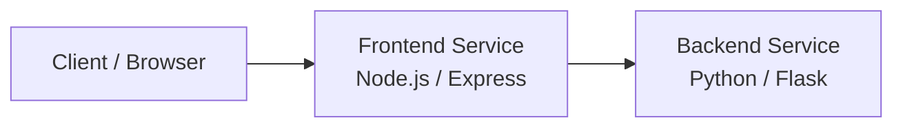

# DevOps Internship Task

## week 1

## Overview

This project contains two simple dummy microservices for a cloud-native learning setup:

- Frontend service built with Node.js and Express
- Backend service built with Python and Flask

Both services expose health and informational endpoints and are containerized with optimized multi-stage Dockerfiles that run as non-root users.

## Architecture

This project follows a simple microservices-style architecture designed for learning and internship demonstrations.

### High-level design



### Component responsibilities

- Frontend service
  - Exposes the user-facing entry point on port 3000
  - Handles requests to /, /health, and /info
  - Serves as the first contact point for incoming traffic

- Backend service
  - Exposes application logic and health endpoints on port 5000
  - Returns structured JSON responses for monitoring and testing
  - Represents a second independent service in the architecture

### Request flow

1. A client sends a request to the frontend service.
2. The frontend responds directly for simple routes such as / and /health.
3. The backend service can be called separately for its own health and info endpoints.
4. Both services are containerized and can be deployed independently in a larger environment.

### Deployment view

- Each service runs in its own container
- Containers are isolated and can be scaled independently
- The design can later be extended with ingress, load balancers, Kubernetes, and service discovery

## Prerequisites

The following tools should be available for this setup:

- WSL2 or a Linux-compatible environment
- Docker Desktop or equivalent container runtime
- kubectl
- Terraform
- Helm

## Project Structure

```text
backend/
  app.py
  Dockerfile
  requirements.txt
frontend/
  app.js
  Dockerfile
  package.json
Readme.md
```

## Local Build and Run

### 1. Build images

```bash
docker build -t frontend ./frontend
docker build -t backend ./backend
```

### 2. Run containers
    
```bash
docker run -d --name frontend-demo -p 3000:3000 frontend
docker run -d --name backend-demo -p 5000:5000 backend
```

### 3. Verify endpoints

```bash
curl http://localhost:3000/health
curl http://localhost:3000/info
curl http://localhost:5000/health
curl http://localhost:5000/info
```

## Endpoints

- Frontend: /, /health, /info
- Backend: /, /health, /info

## Notes

This setup is intentionally lightweight and suitable for internship demonstrations, learning Docker multi-stage builds, and practicing container orchestration basics.
